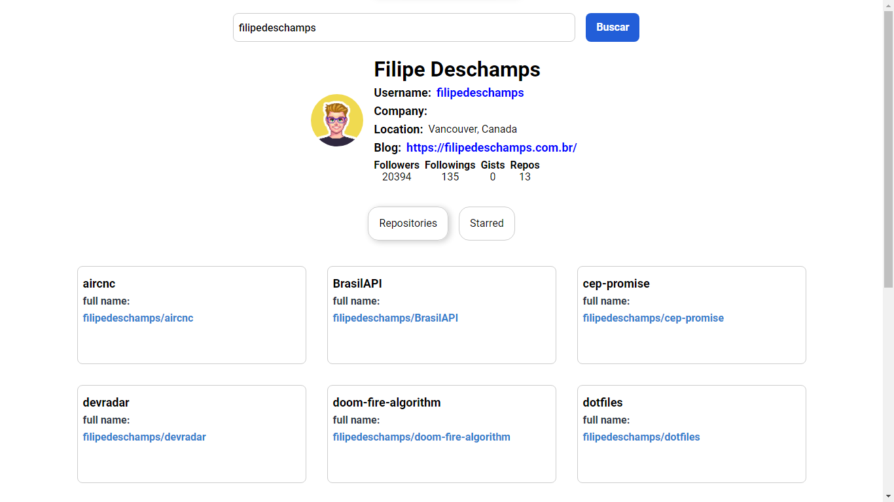

    
 

Projeto realizado no Bootcamp de React do Digital Inovation One

<a href="https://restaurants-search-dun.vercel.app/">Github Interface</a>

  

## Sobre o projeto

Projeto executado durante o Bootcamp de React da LocalizaLabs, pelo Digital Inovation One, utilizando ReactJs e a API do Github.

## Tecnologias e bibliotecas utilizadas

- ReactJS
- Styled Components
- Github API

